# Project Management App

A full-stack web app I built to practice real-world project workflows: teams, projects, tasks, comments, and role-based access. It started as an MVP for learning PHP and MySQL, but it grew into something I actually use to understand how permissions, validation, and UI fit together in one codebase.

Three roles drive most of the behaviour: **Admin**, **Project Manager**, and **Team Member**. Each one sees a different slice of the system — not just different buttons, but different data scope (for example, a manager only works with teams they belong to).

---

## What it does (in short)

- Login, registration, password reset, and profile editing
- Admin approval for newly registered accounts
- Teams linked to users through a many-to-many relationship
- Projects assigned to teams, tasks assigned to users
- Comments on tasks, with edit/delete for managers and admins
- In-app notifications for team members (task assignments, due-date reminders, project updates, and more)
- Global search across projects, teams, and users

- Separate colour themes per role (admin / manager / member)

---

## Tech stack

| Layer | Tools |
|-------|--------|
| **Backend** | PHP 8.2, procedural style, PDO, PHP sessions |
| **Database** | MySQL / MariaDB |
| **Frontend** | HTML5, CSS3, vanilla JavaScript |
| **HTTP / AJAX** | Fetch API for profile, password, comments, notifications, search |
| **Email** | [PHPMailer](https://github.com/PHPMailer/PHPMailer) (Composer) — password reset emails via SMTP |
| **Security** | Google reCAPTCHA v2, `password_hash` / `password_verify`, server- and client-side validation |
| **Sanitization** | [DOMPurify](https://github.com/cure53/DOMPurify) (CDN) on profile form input |
| **DOM / UX helpers** | jQuery 3.6 (loaded on admin & manager pages) |
| **Icons** | [Fontello](https://fontello.com/) custom icon set |
| **Local dev** | XAMPP, phpMyAdmin, Git |

Dependencies are managed with Composer (`phpmailer/phpmailer`). Front-end libraries loaded from CDN where it made sense during development.

---

## Roles at a glance

| Role | Main purpose |
|------|----------------|
| **Admin** | Global oversight: all teams, projects, tasks; approves or rejects new user registrations |
| **Project Manager** | Runs work inside **their** teams — projects, tasks, members, comments |
| **Team Member** | Works on **assigned tasks** — update status, view details, add comments, receive notifications |

New users pick **Team Member** or **Project Manager** at registration. **Admin** accounts are not self-service. Every new account starts as `is_approved = 0` until an admin accepts it.

---

## Functional requirements by role

Below is what each role can do for each main entity.  
**C** = Create · **R** = Read · **U** = Update · **D** = Delete · **—** = not available · **scoped** = limited by team membership or assignment

### Users & authentication

| Action | Admin | Project Manager | Team Member |
|--------|:-----:|:---------------:|:-----------:|
| Register (self-service) | — | ✓ (pending approval) | ✓ (pending approval) |
| Login | ✓ | ✓ | ✓ |
| Password reset (email link) | ✓ | ✓ | ✓ |
| Approve pending user | **C/U** | — | — |
| Reject / delete pending user | **D** | — | — |
| Add user to team | — | **C** (approved Team Members only) | — |
| Remove user from team | — | **D** (cannot remove another PM) | — |
| Edit own profile (name, email) | —* | **U** | **U** |
| Change own password (logs out after success) | —* | **U** | **U** |

\*Admin has no dedicated profile page in the nav; profile/password endpoints work for any logged-in user.

**Business rules**

- Login requires a valid password **and** `is_approved = 1`.
- Registration validates names, email, strong password rules, and reCAPTCHA.
- After a password change, the session is cleared and the user is sent back to the login page with a success message.

---

### Teams

| Action | Admin | Project Manager | Team Member |
|--------|:-----:|:---------------:|:-----------:|
| **C** Create team | ✓ (assigns a PM as team leader) | ✓ (creator is auto-added to the team) | — |
| **R** List teams | All teams | **scoped** — only teams they belong to | — |
| **R** Team details & members | Any team | **scoped** — their teams | — |
| **U** Rename team | ✓ | ✓ | — |
| **D** Delete team | ✓ | ✓ | — |
| **C** Add member to team | —* | ✓ (Team Members only, must be approved) | — |
| **D** Remove member from team | —* | ✓ (not another Project Manager) | — |

\*Admin can view team details; member add/remove UI exists on admin team pages, but the backing scripts live under the manager module.

**Business rules**

- A team has many users via `team_user`; projects belong to one team.
- When a PM creates a team, they are inserted into `team_user` automatically.
- Team rename triggers in-app notifications for affected team members.

---

### Projects

| Action | Admin | Project Manager | Team Member |
|--------|:-----:|:---------------:|:-----------:|
| **C** Create project | ✓ (any team) | **scoped** — team dropdown lists only teams the PM belongs to | — |
| **R** List projects | All projects (paginated) | **scoped** — projects whose team the PM is in | — |
| **R** Project details | ✓ | ✓ (via selected project in session) | — |
| **U** Edit project | ✓ | ✓ (name, description, dates, status, priority, team) | — |
| **D** Delete project | ✓ | ✓ | — |

**Business rules**

- Project fields include name, description, start/end dates, status, priority, and linked team.
- PM dashboard counts (projects, tasks, teams, members) are filtered by `team_user.user_id`.
- Project status changes can notify team members in the project’s team.
- List views use pagination (e.g. 13 projects per page on manager/admin lists).

---

### Tasks

| Action | Admin | Project Manager | Team Member |
|--------|:-----:|:---------------:|:-----------:|
| **C** Create task | ✓ | ✓ (on current project) | — |
| **R** List tasks | ✓ (within project context) | ✓ (within project context) | **scoped** — only tasks where `assigned_user_id = me` |
| **R** Task details | ✓ | ✓ | **scoped** — assigned tasks only |
| **U** Edit task (full) | ✓ | ✓ (title, description, priority, status, due date, assignee) | — |
| **U** Update task status only | — | — | ✓ (from task list / detail UI) |
| **D** Delete task | ✓ | ✓ | — |

**Business rules**

- Tasks belong to a project and are assigned to one user.
- Priority (Low / Medium / High) and status (e.g. Not Started, In Progress, Completed, Cancelled) are tracked in the UI with visual indicators.
- Reassigning a task notifies the new assignee.
- Team members have a tasks list view and a kanban-style page entry point (`tasks-kanban.php`).

---

### Comments

| Action | Admin | Project Manager | Team Member |
|--------|:-----:|:---------------:|:-----------:|
| **C** Add comment on task | ✓ | ✓ | ✓ |
| **R** Read comments | ✓ | ✓ | ✓ (on accessible tasks) |
| **U** Edit comment | ✓ | ✓ | — |
| **D** Delete comment | ✓ | ✓ | — |

**Business rules**

- Comments store author, content, and timestamp.
- When a PM adds a comment, the assigned team member can receive a notification.

---

### Notifications

| Action | Admin | Project Manager | Team Member |
|--------|:-----:|:---------------:|:-----------:|
| **R** View in-app notifications | — | — | ✓ (bell icon in header) |
| **U** Mark as read | — | — | ✓ (own notifications only) |

**Notification types include:** new task assigned, task reassigned, comment on task (from PM), project status changed, team renamed, added to team, and due-date reminders (tasks due within 3 days, excluding Completed / Cancelled).

---

### Search

| Action | Admin | Project Manager | Team Member |
|--------|:-----:|:---------------:|:-----------:|
| **R** Global search (projects, teams, users) | ✓ | ✓ | ✓ (UI present; some result links target manager/admin routes) |

Search runs as the user types (minimum 2 characters) and returns up to 10 matches per category. Approved users only appear in people search.

---

## Database

Main tables:

| Table | Purpose |
|-------|---------|
| `user` | Accounts, roles, approval flag |
| `team` | Team name and metadata |
| `team_user` | Many-to-many: users ↔ teams |
| `project` | Project linked to a team |
| `task` | Task linked to project + assignee |
| `comment` | Comment on a task |
| `notification` | In-app notifications for team members |
| `password_resets` | Hashed tokens for password reset flow |

Full schema and sample data: [`project_management.sql`](./project_management.sql)

---

## Project structure (simplified)

```
project_management/
├── admin/          # Admin pages & CRUD endpoints
├── manager/        # Project Manager pages & CRUD endpoints
├── user/           # Team Member pages & endpoints
├── view/           # Shared layouts (nav, header, role-specific views)
├── template/       # HTML fragments for modals & table rows
├── css/            # main.css, theme-*.css, responsive.css
├── scripts/        # JS (forms, modals, search, notifications, …)
├── functions.php   # Shared helpers, query(), auth (require_role)
├── login.php       # Authentication
├── register-user.php
├── notification_service.php
└── project_management.sql
```

Auth is enforced with `require_role("…")` at the top of protected scripts. Shared DB access goes through a single `query()` helper using PDO prepared statements.

---

## Security notes

This is a learning project, but several good practices are in place:

- Password hashing with `password_hash()` / `password_verify()`
- Prepared statements (PDO) for SQL
- reCAPTCHA on login, registration, and forgot-password
- Session regeneration on login and after password change
- Role checks on server-side endpoints
- Input validation on both PHP and JavaScript (DOMPurify on profile fields)
- Password reset tokens stored hashed, with expiry (15 minutes)

---

## Getting started locally

1. Clone the repo into your web root (e.g. `htdocs/project_management`).
2. Import `project_management.sql` into MySQL (phpMyAdmin or CLI).
3. Adjust DB credentials in `connect.php` if needed.
4. Run `composer install` for PHPMailer.
5. Set reCAPTCHA keys in `config.php` and SMTP settings in `PHPMailerConfig.php`.
6. Open `http://localhost/project_management/` in the browser.

Default admin credentials (if using the bundled SQL seed) are documented in the dump / your local notes — change them after first login in a real deployment.

---

## Screenshots

| | |
|---|---|
| Login | 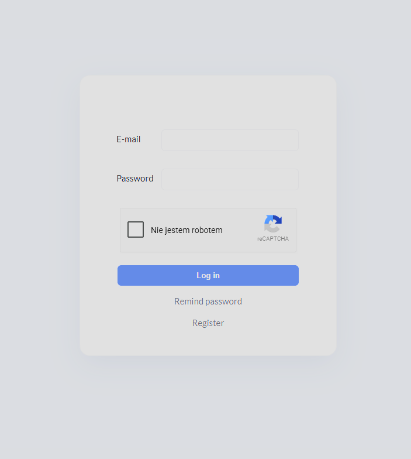 |
| Register | 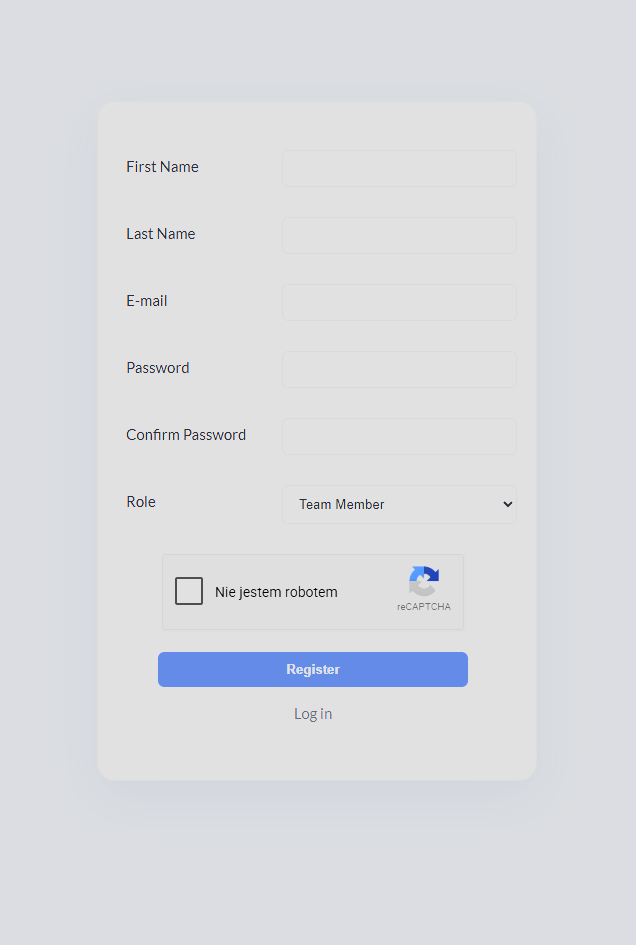 |
| Password reset | 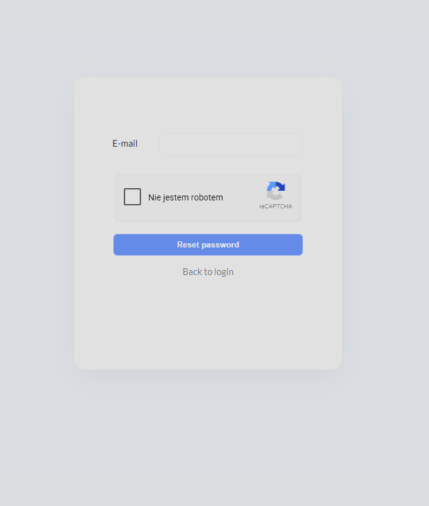 |
| Project Manager Main Dashboard | 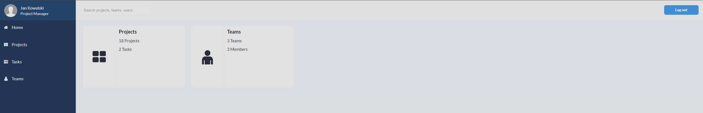 |
| Search bar | 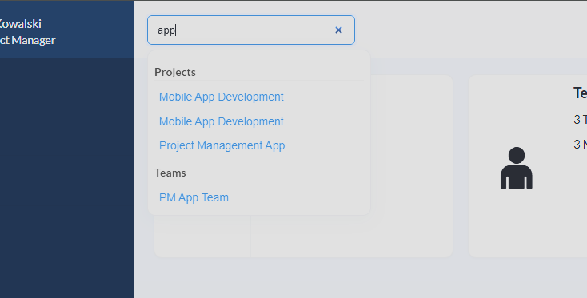 |
| Projects | 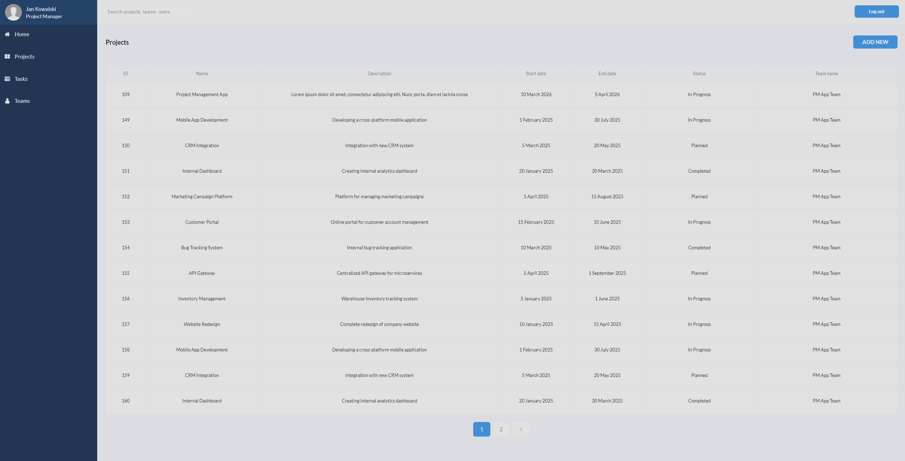 |
| Adding new project | 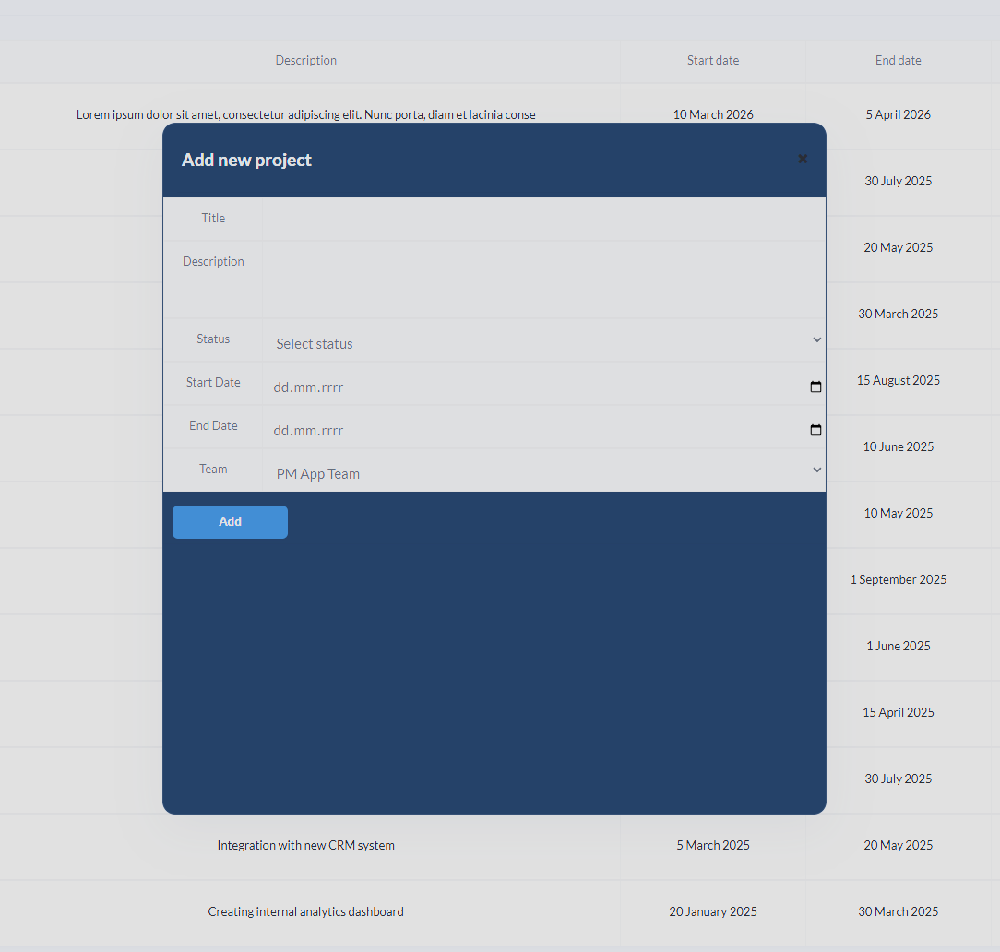 |
| Project details | 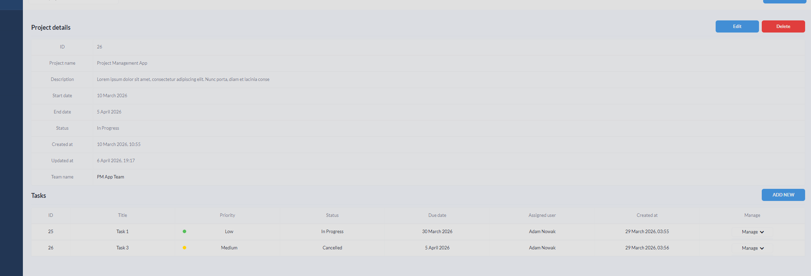 |
| Adding new task | 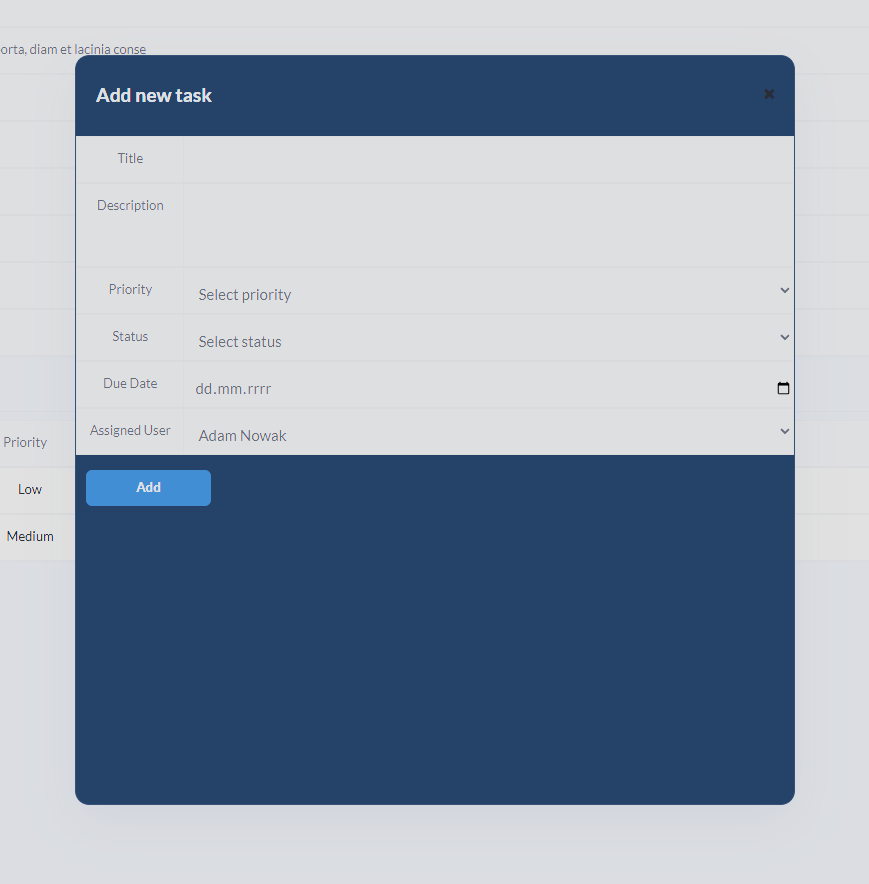 |
| Edit project | 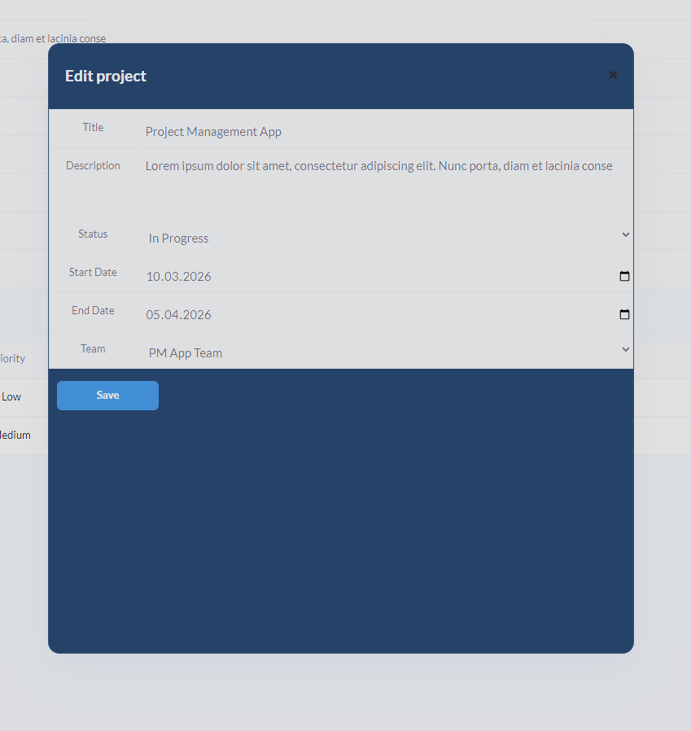 |
| Managing tasks | 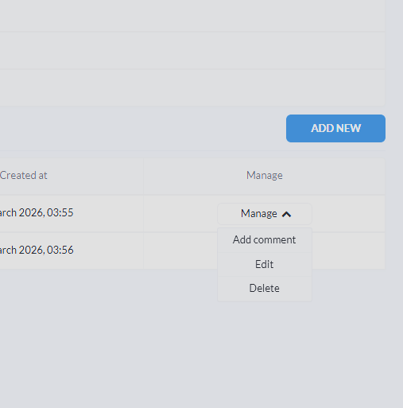 |
| Task details | 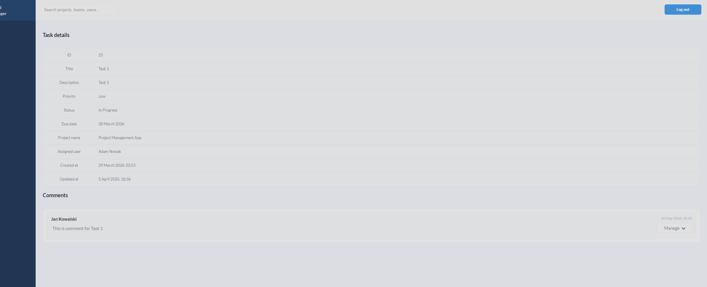 |
| Teams | 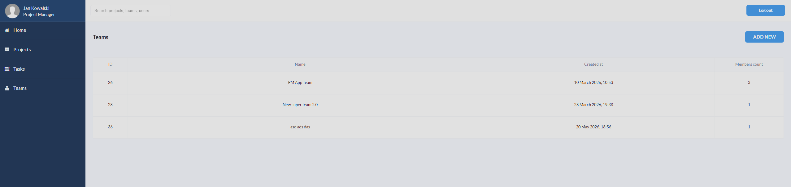 |
| Adding new teams | 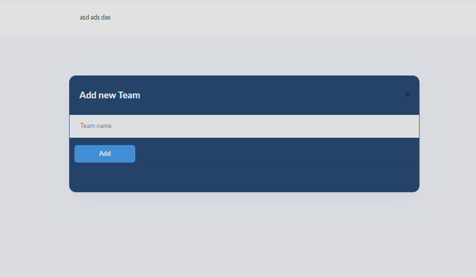 |
| Team details | 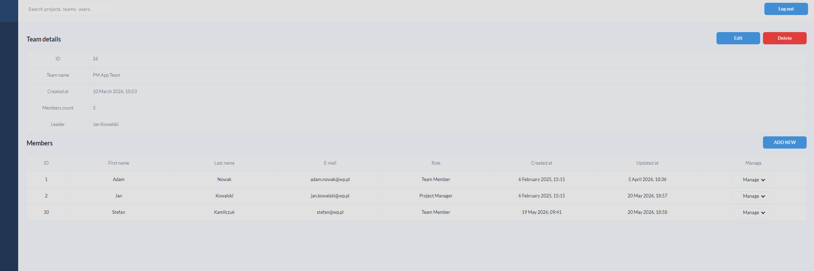 |
| Edit team | 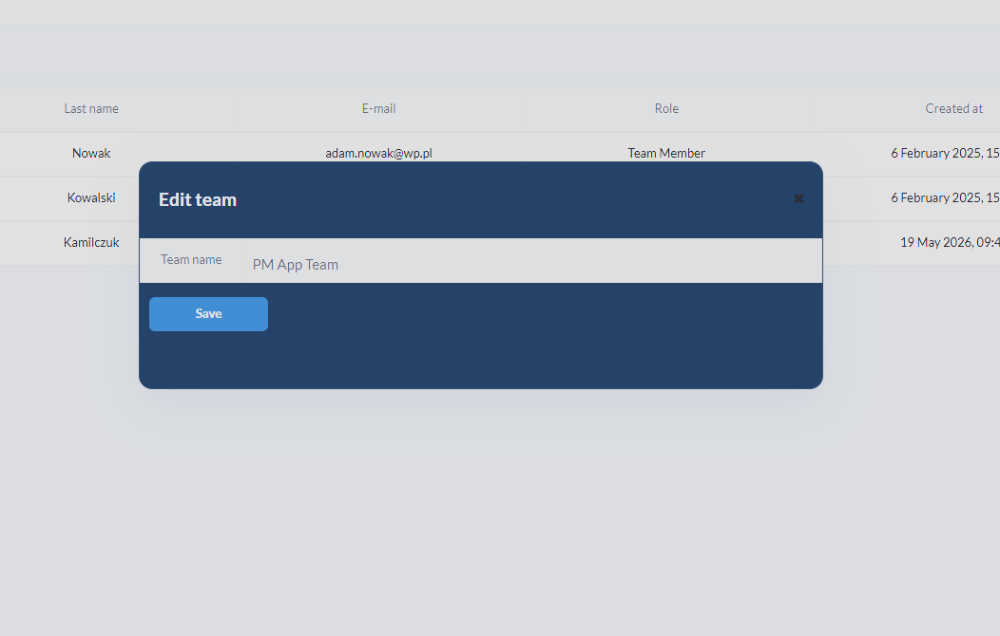 |
| More views | 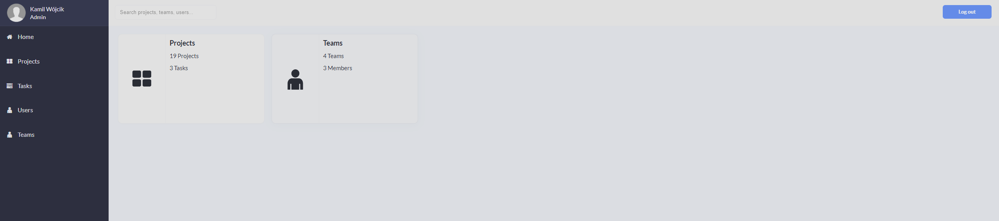 · 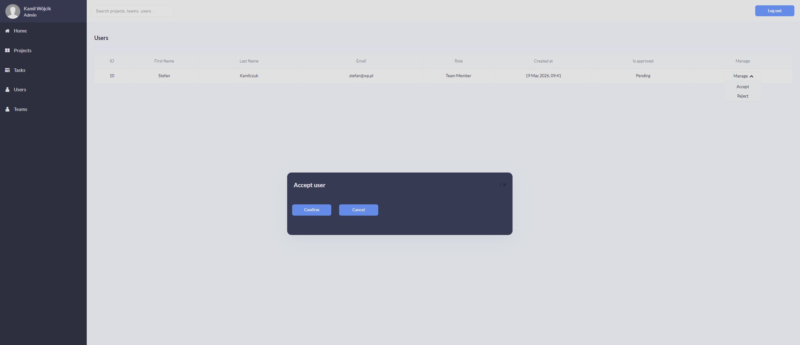 · 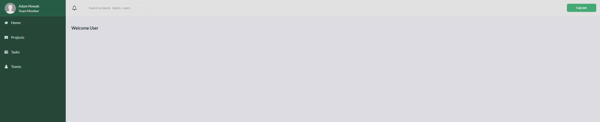 · 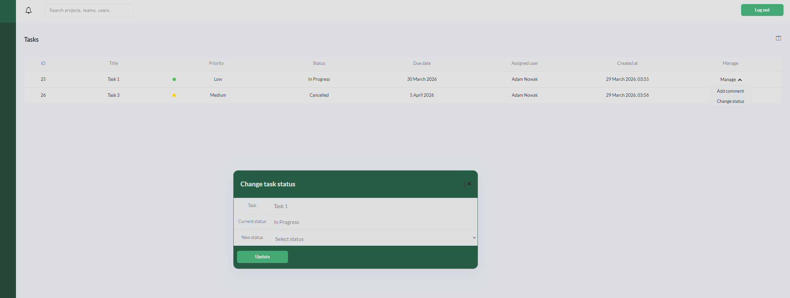 · 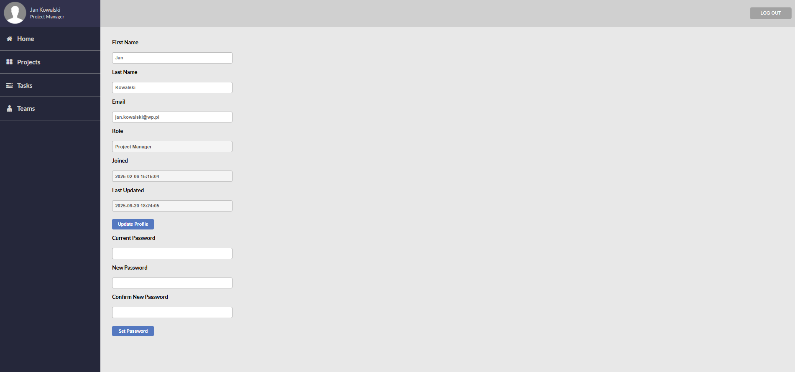 |

---

## Status & future ideas

The app is a working MVP. Some write endpoints rely on UI scoping (e.g. team dropdowns for PMs) more than strict server-side checks on every mutation — fine for learning, worth tightening before production.

Possible next steps: stricter API scoping, admin profile page, CSRF tokens, rate limiting on login, and a fully wired kanban board for team members.

---

## License

Personal / educational project.
