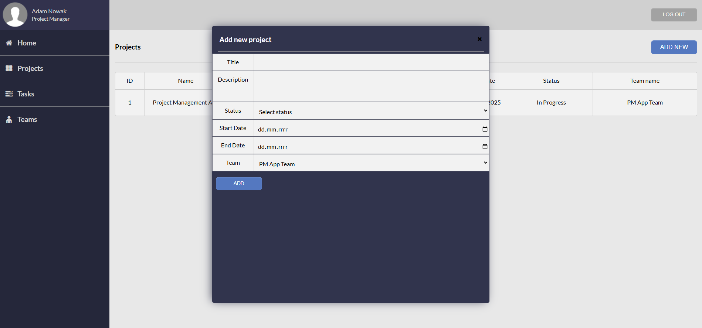
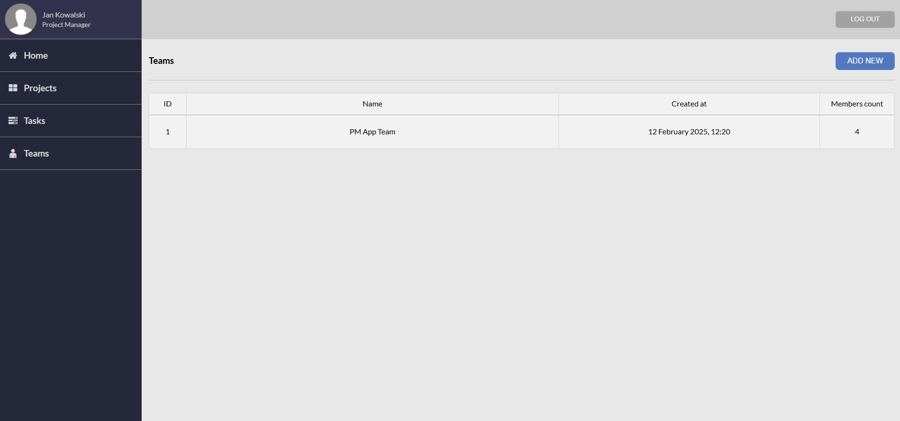

# 📌 Project Management App

A web-based application for **project management, team collaboration, and task tracking**.  
Created as an MVP project to practice **full-stack web development** using PHP, MySQL, JavaScript, and modern web standards.

---

## ✨ Features

- 👤 **User authentication & roles** (Admin, Project Manager, Team Member)
- ✅ **Account approval system** (Admin verifies new users)
- 📂 **Projects** – create, edit, update, delete, assign teams
- 📝 **Tasks** – assign tasks to users, set deadlines, priorities, track status
- 👥 **Teams** – assign users to teams, view team details and members
- 💬 **Comments** – add discussion to tasks
- 🔒 **Security**
    - Sessions, password hashing (`password_hash`)
    - Validation on frontend (JS + DOMPurify) and backend (PHP)
    - reCAPTCHA integration on login/registration
    - PHPMailer for password reset and notifications
- 📊 **Dashboard** – quick info about projects and tasks
- 🎨 **UI/UX** – simple responsive design with **HTML5 + CSS3**, icons via **Fontello**

---

## 🛠️ Technologies

- **Backend:** PHP 8.2 (procedural, PDO, sessions, validations)
- **Database:** MySQL
- **Frontend:** HTML5, CSS3, JavaScript (AJAX + Fetch API, DOMPurify for sanitization)
- **Security:** reCAPTCHA v2, password hashing, input validation
- **Email:** PHPMailer (SMTP)
- **Icons:** Fontello
- **Other tools:** Git, phpMyAdmin, XAMPP

---

## 🗄️ Database Schema

The system uses the following main tables:

- `user` – users with roles (Admin, PM, Team Member)
- `team` – project teams
- `team_user` – many-to-many relation between users and teams
- `project` – project details (linked to team)
- `task` – tasks assigned to projects/users
- `comment` – comments for tasks
- `password_resets` – password reset tokens

➡️ Full SQL dump: [`project_management.sql`](./project_management.sql)

Main login page (index.php): 

Register page:

Password reset page:

Main page (after log in) for Team Member (role):

Tasks View:

Projects View (Project Manager Role):

Adding New Project:

Project Details View (Project Manager Role):

Editing Project:

Adding New Task:

Editing Task:

Deleting Task:

After Successful Registration:

Attempted to log in before the administrator approved the account:

Verification of user accounts by the administrator:

User profile page:

Teams page:

