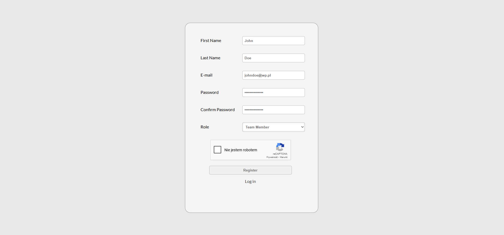
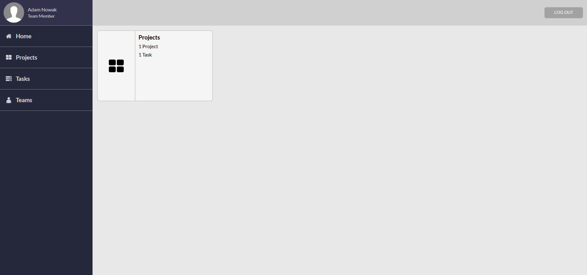
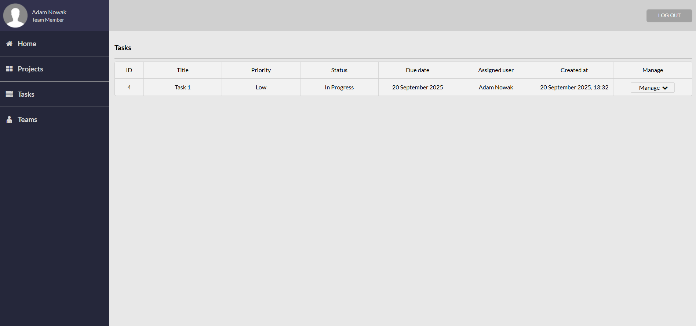
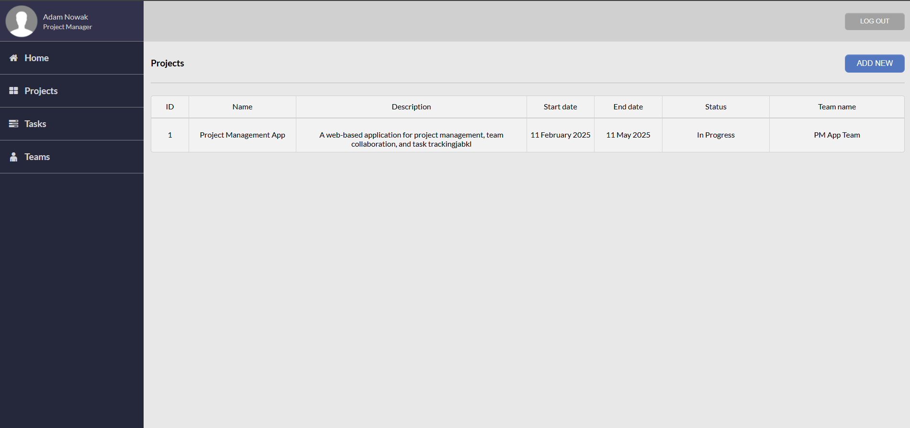
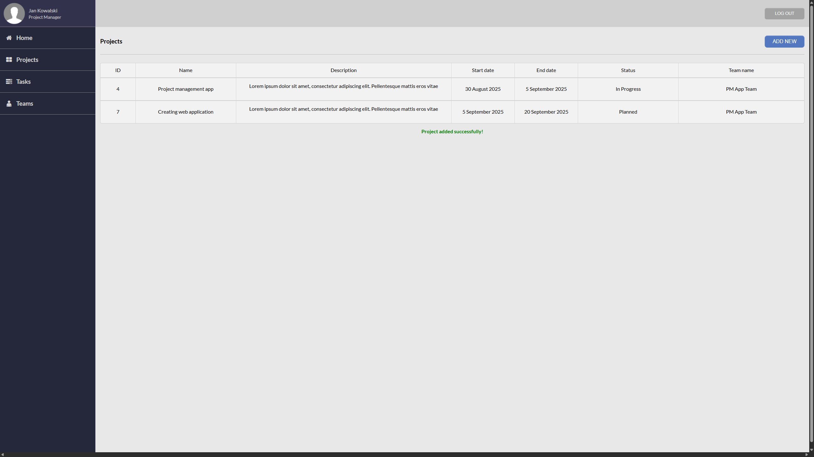
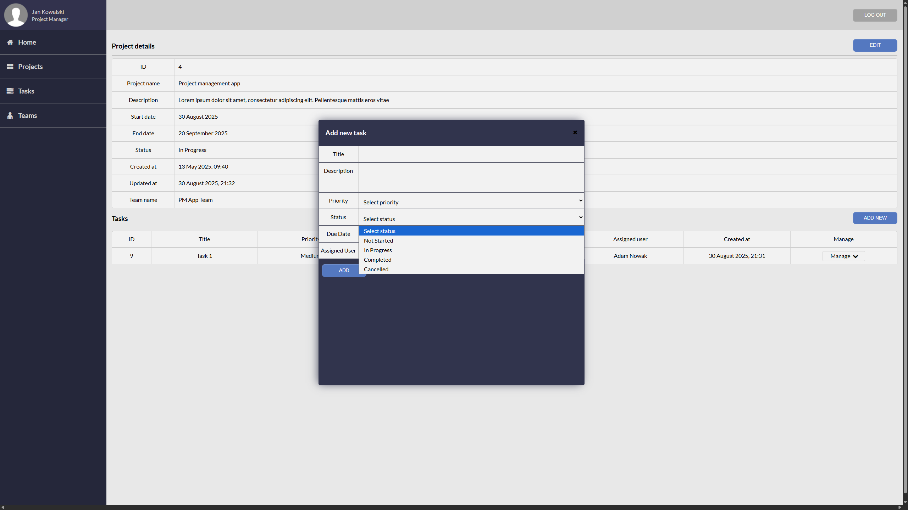

A simple MVP project management application. It enables features such as user login and registration, creating projects, editing projects, adding tasks to projects, assigning users to projects and tasks, editing tasks, and verifying new accounts by the system administrator.

Main login page (index.php): 

Register page:

Main page (after log in) for Team Member (role):

Tasks View:

Projects View (Project Manager Role):

Adding New Project:

Project Details View (Project Manager Role):

Editing Project:

Adding New Task:

Editing Task:

Deleting Task:

After Successful Registration:

Attempted to log in before the administrator approved the account:

Verification of user accounts by the administrator:

